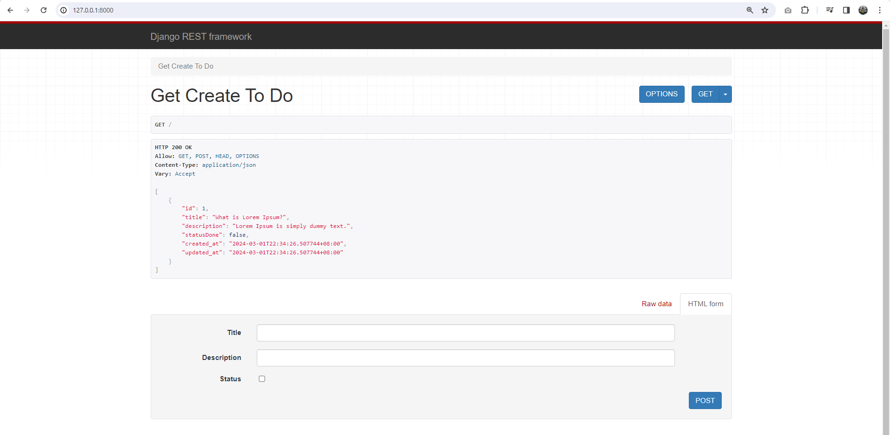
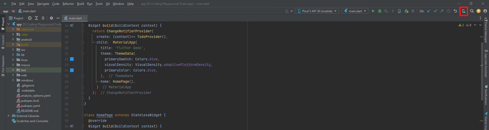
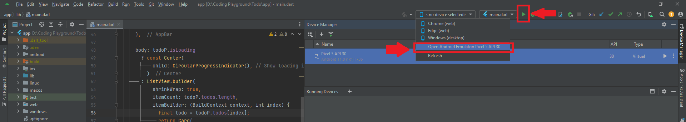
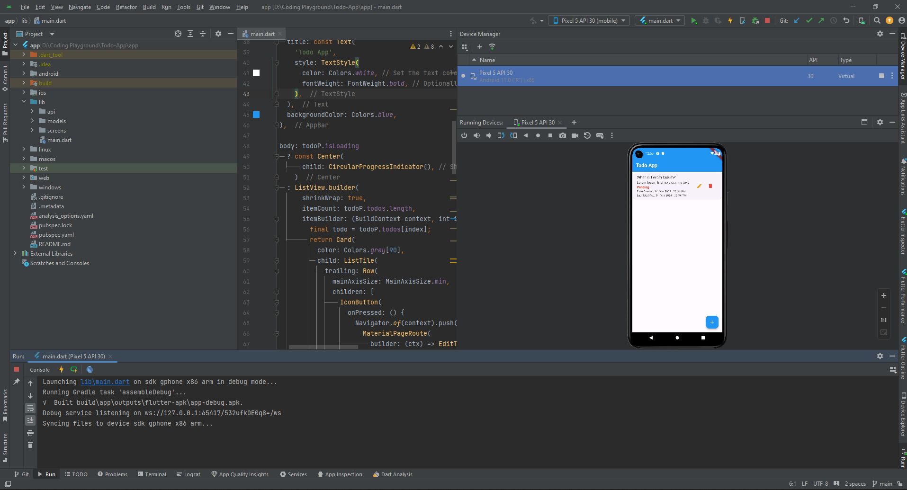

## Todo App

This repository contains a Todo application with a Django backend API (in the `backend` folder) and a Flutter frontend (in the `app` folder). 

##  Table of Contents

- [Django Backend](#django-backend)
  - [Installation](#installation)
  - [Usage](#usage)
- [Flutter App](#flutter-app)
  - [Installation](#installation-1)
  - [Setting up Android Studio](#setting-up-android-studio)
  - [Usage](#usage-1)
  
[TOC]


## Django Backend

### Installation

1. Git clone Todo App https://github.com/mimikhalid/Todo-App.git

2. Install Python: Download and install the latest version of Python from [python.org](https://www.python.org/downloads/).

3. Install Django: Open a command prompt or terminal and run:

   ```
   pip install django
   ```

4. Navigate to the Django project directory:

   ```
   cd backend
   ```

5. Run migrations.

   ```
   python manage.py migrate
   ```

6. Run fixtures.

   ```
   python manage.py loaddata fixtures/todo
   ```

7. Run the Django development server:

   ```
   python manage.py runserver
   ```

### Usage

1. Start the Django development server:

   ```
   cd backend
   python manage.py runserver
   ```

   

2. Manage Todo items at http://127.0.0.1:8000/

   
   

## Flutter App

### Installation

1. Install Flutter : Follow the [official Flutter installation guide](https://docs.flutter.dev/get-started/install/windows/mobile?tab=download#install-the-flutter-sdk) to install Flutter on your system.

2. Navigate to the Flutter project directory:

   ```
   cd app
   ```

3. Run the following command to get the dependencies:

   ```
   flutter pub get
   ```

#### Setting up Android Studio

1. Install Android Studio: Download and install Android Studio from [developer.android.com/studio](https://developer.android.com/studio). 

2. Configure toolchain: Follow the instructions in the [Flutter documentation](https://flutter.dev/docs/get-started/install/windows#android-setup). 

3. Install the Flutter plugin:

   ```
   - File -> Settings
   - In the Settings dialog, navigate to Plugins under the IDE Settings category.
   - Here, search for the Flutter plugin by typing "Flutter" in the search bar.
   - Click on the Install button next to it to install the plugin.
   - After installation, restart Android Studio for the changes to take effect.
   ```

   

4. Import to folder flutter to Android Studio:

   ```
   - File -> Open
   - In the Open Project dialog, click on 'app' in Todo-App folder.
   - Click OK.
   ```

   

5. Configure an Android device or emulator: Click on **AVD** icon as shown : 

   

   - click on **Create Virtual Device** and choose hardware with these specifications : 
     - Name : Pixel 5
     - Size : 6.0"
     - Resolution : 1080x2340
     - Density 440dpi
   - and click **Next**.
   - **Select Version/Image** and click **Download**.
   - After the download **finish**, click **Next** and click **Finish**.

### Usage

1. To launch the android emulator, click on the button as shown.

   - Click on flutter device selection, and select as example.
   - After device is running, click on play icon to run main.dart file.

   

2. The results will be as shown below:
   
